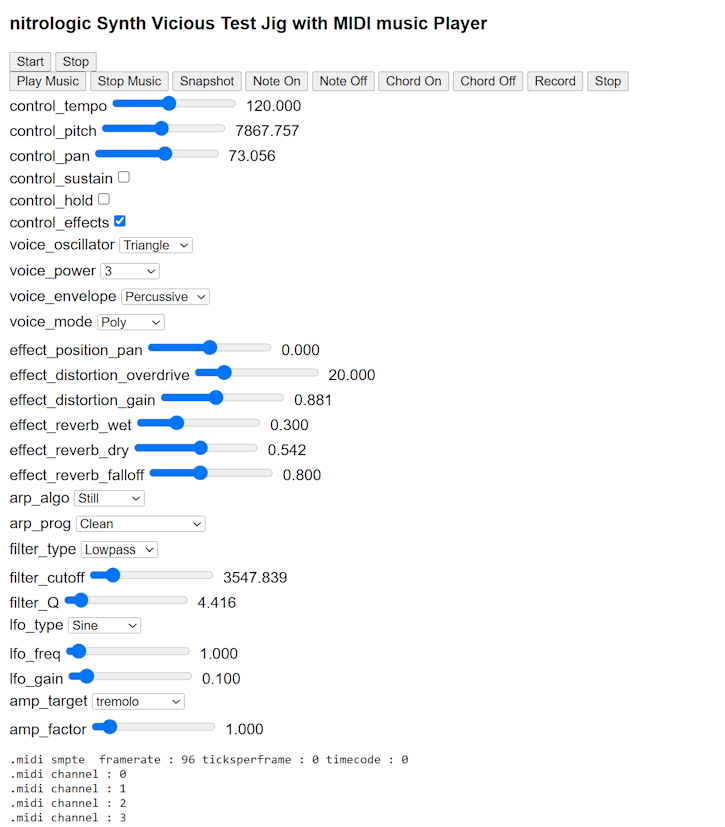

# vsynth js worker                                                                                                                                    

 
 
    

# vsynth

Second generation synth vicious sound engine

# test interface

https://nitrologic.github.io/vsynth/

# development

https://github.com/nitrologic/vsynth

# dsptool integration

https://www.youtube.com/watch?v=U8-qkxWCn2Y

# original vsynth project

https://nitrologic.itch.io/synth-vicious
