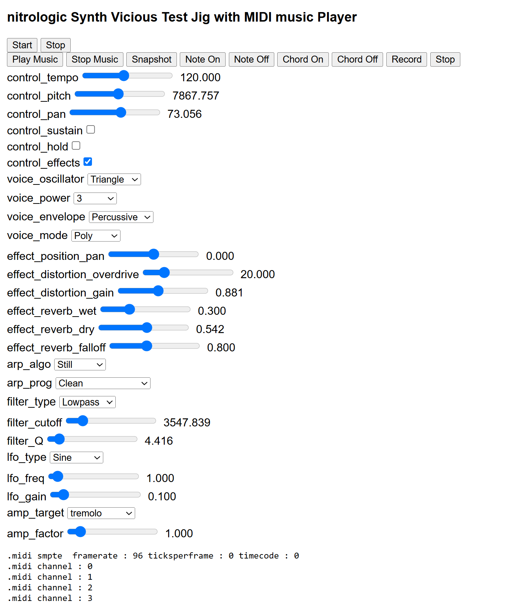

# vsynth

The synth vicious audio engine at it's core is a modern web worker capable of some heavy lifting signal paths.

# link

https://nitrologic.github.io/vsynth/

# development

https://github.com/nitrologic/vsynth

# dsptool integration

https://www.youtube.com/watch?v=U8-qkxWCn2Y

# history

The original monkey2 [Synth Vicious](https://nitrologic.itch.io/synth-vicious)
